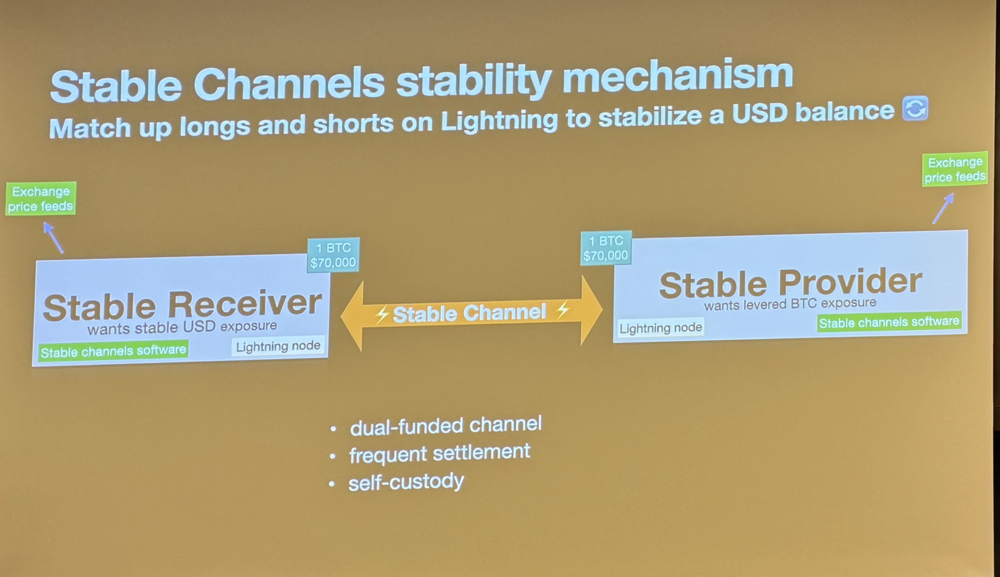

# Stable Channels

General idea: Get self-custodial stable fiat value on bitcoin.

Risk: Stable provider can get liquidated if price drops 50%. Since the stable provider has a 2x leverage.

## Links
- [Implementation](https://github.com/toneloc/stable-channels/)
- [eCash Mint using Stable Channels](https://umint.cash/)

## Stable Channels overview
